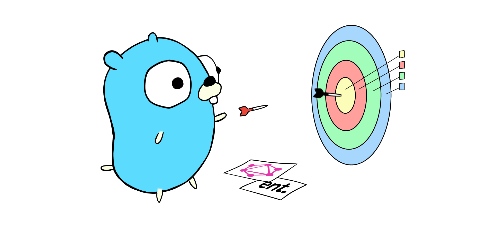

# gqlgen-ent-clean-architecture-boilerplate

A Clean Architecture boilerplate for Golang applications built with gqlgen and ent.

[The Go gopher](https://go.dev/blog/gopher) was designed by [Renée French](https://www.instagram.com/reneefrench/).

# References
* [gqlgen](https://gqlgen.com/)
    * [Getting Started](https://gqlgen.com/getting-started/)
* [ent](https://entgo.io/)
    * [First Steps](https://entgo.io/docs/tutorial-setup)
    * [GraphQL Basics](https://entgo.io/docs/tutorial-todo-gql)